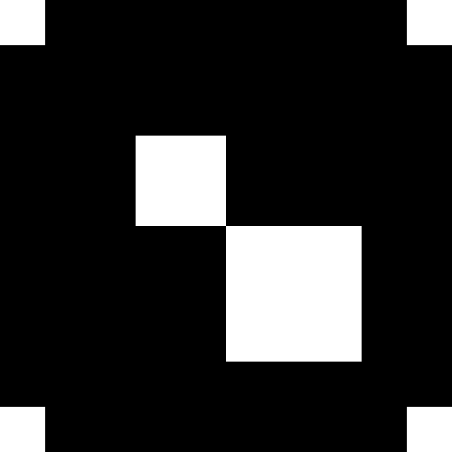

# Dilation-and-Erosion-from-Scratch
This repository contains the implementation of Dilation and Erosion from scratch with an animation showing step by step changes. 
- Input image 
 
- Dilation 
 
- Erosion 

